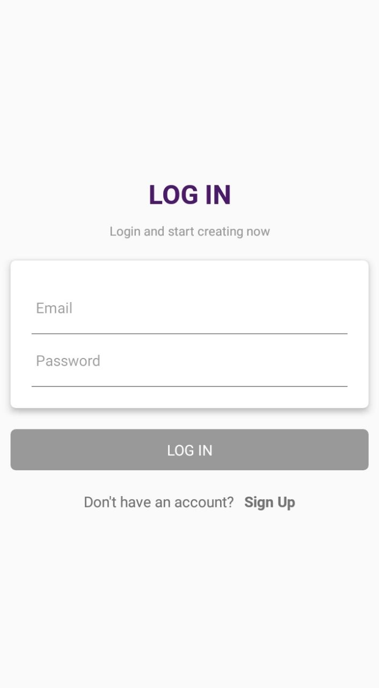
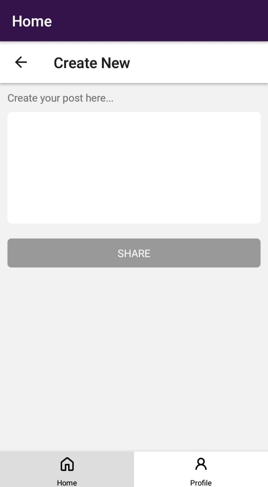

# Create and Share Native

A simple social application for users to create and share content together. Built with React Native and Firebase.

### Functionalities 

- Login/Signup with email and password.

 | 

- View profile.

- Create a new post.

- View users' posts.

### Dependencies

- Firebase
@react-native-firebase/app
@react-native-firebase/auth
@react-native-firebase/database

- React Navigation 
@react-navigation/bottom-tabs
@react-navigation/native
@react-navigation/native-stack

- moment

### To run on Android
npm run android

### To run on IOS
npm run ios

